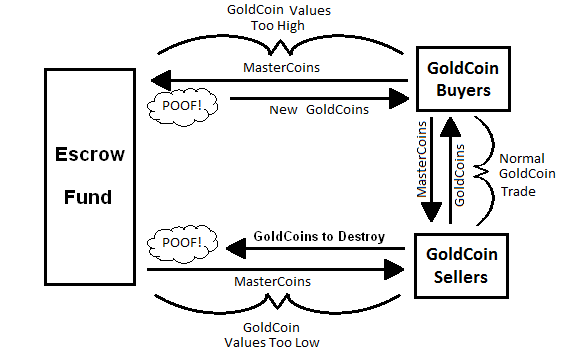

= OLE 099
:toc: macro
:toclevels: 3

....
  OLE: 099
  Layer: Consensus
  Title: Unimplemented Features from Original Omni Layer Specification
  Author: The Original Omni Specifiers
  Comments-Summary: No comments yet.
  Comments-URI: https://github.com/OmniLayer/Documentation/blob/master/OLEs/ole-099.adoc
  Status: Draft (Withdrawn)
  Type: Informational
  Created: 2012-01-06
  License: http://unlicense.org
....

== Introduction

=== Abstract

This document contains proposals for features that were described in the Omni Layer Specification v0.6 that have not been implemented and are not currently under development. Some of these proposed features first appeared in the original "The Second Bitcoin Whitepaper" by J.R. Willett.

This OLE is informational only. Once we have team agreement that this document is complete, the status will change from _Draft_ to _Withdrawn_. If someone wants to propose implementing any of the features in this document, they can and should submit one or more new **OLE**s for the feature(s) they wish to implement.

The <<Specification>> section of this OLE is essentially a copy of the "Future Transactions" section of Omni Layer Specification v0.6.

=== Copyright

This OLE is licensed under the http://unlicense.org[Unlicense] as was the Omni Specification v0.6.

=== Table of Contents

Since this is a historical document, the formatting of this OLE is slightly different. We are providing an in-line, 3-level, table of contents to make it easy to see all the proposed transactions at a glance.

toc::[]

== Specification

This OLE is *WITHDRAWN* and has been published for information purposes only, the transactions described below _are not implemented_ in Omni Core based upon this document. It is possible that some subset of these transactions could be implemented in the future if new OLEs for those features are created, approved, and implemented.

=== Creating a List of Addresses

The Omni Protocol allows the creation of a list of addresses which can
then be referenced by other transactions. For instance, some tokens may
be restricted to only be used by a set of approved addresses, such as
addresses of people who have provided identifying documentation in
compliance with KYC (know your customer) AML (anti-money-laundering)
laws. See the introduction to link:#smart-property[Smart Property] above
for details on how to restrict a token to a set of addresses.

To create or append a list of addresses, publish the following
notification from the address which will maintain the list:

[cols=",,",options="header",]
|===
|*Field* |*Type* |*Example*
|Transaction version |link:#field-transaction-version[Transaction
version] |0

|Transaction type |link:#field-transaction-type[Transaction type] |32

|Number of addresses |link:#field-integer-one-byte[Integer one-byte] |4

|Address 1 |link:#field-bitcoin-address[Bitcoin Address]
|010966776006953D5567439E5E39F86A0D273BEE

|Address 2 |link:#field-bitcoin-address[Bitcoin Address]
|010966776006953D5567439E5E39F86A0D273BED

|Address 3 |link:#field-bitcoin-address[Bitcoin Address]
|010966776006953D5567439E5E39F86A0D273BEC

|Address 4 |link:#field-bitcoin-address[Bitcoin Address]
|010966776006953D5567439E5E39F86A0D273BEB
|===

That transaction effectively starts the list (or appends it), and
provides a handle to refer to the list (the address which published this
message). Note that this transaction could be massive if a lot of
addresses are added, and may require large fees in bitcoins.
Additionally, 0.00000001 MSC (smallest unit of MSC) are burned for each
address added, so the address maintaining the list must have enough MSC
and BTC on hand to cover these fees.

=== Removing Addresses from a List

To remove addresses from a list, publish the following notification from
the address which maintains the list:

[cols=",,",options="header",]
|===
|*Field* |*Type* |*Example*
|Transaction version |link:#field-transaction-version[Transaction
version] |0

|Transaction type |link:#field-transaction-type[Transaction type] |33

|Number of addresses |link:#field-integer-one-byte[Integer one-byte] |2

|Address 1 |link:#field-bitcoin-address[Bitcoin Address]
|010966776006953D5567439E5E39F86A0D273BEE

|Address 2 |link:#field-bitcoin-address[Bitcoin Address]
|010966776006953D5567439E5E39F86A0D273BED
|===

Any referenced addresses are removed from the list. Note that as with
the previous transaction type, this transaction could be massive if a
lot of addresses are removed, and may require large fees in bitcoins.
Additionally, 0.00000001 MSC (smallest unit of MSC) are burned for each
address removed, so the address maintaining the list must have enough
MSC and BTC on hand to cover these fees.

=== Transactions to Limit Funds (Theft Prevention)

The Omni Protocol defines some transactions which effectively lock funds
from being spent quickly, making theft of a "`savings`" wallet much more
difficult, even if that wallet is online.

==== Marking an Address as "`Savings`"

[arabic]
. link:#field-transaction-version[Transaction version] = 0
. link:#field-transaction-type[Transaction type] = 10
. link:#field-time-period-in-seconds[Reversibility period] = 2,592,000
(30 days)

Marking an address as savings is PERMANENT and cannot be undone. If an
address is marked as savings, the reversibility rules affect not only
Mastercoins, but any Omni Protocol child currency stored at that
address.

When marking an address as savings, the reference payment points to a
"`guardian`" address authorized to reverse fraudulent transactions. The
guardian address should preferably be from an unused offline or paper
wallet. The sending address is the address to be marked as savings.

When a fraudulent transaction is reversed, any pending funds go to the
guardian address, rather than going back to the compromised savings
address. Also, any funds which remain in the compromised address also go
to the guardian wallet.

==== Restricted send

Say you send funds out of a savings wallet. Doing so requires using a
transaction identical to version 0 of "`simple-send`", but with the
transaction type of 2:

[arabic]
. link:#field-transaction-version[Transaction version] = 0
. link:#field-transaction-type[Transaction type] = 2
. link:#field-currency-identifier[Currency identifier] = 1 for
Mastercoin
. link:#field-number-of-coins[Amount to transfer] = 100,000,000
(1.00000000 Mastercoins)

An address marked as savings can only do this "`restricted send`"
transaction type. All other transaction types must be ignored, as they
are invalid from a savings address. This transaction type is also used
for sending from rate-limited wallets.

Funds sent with "`restricted send`" cannot be used until the send is
complete. For instance, when funds are sent from a savings wallet, they
are considered "`pending`" until the reversibility window is past.
During the window, the transfer is not considered complete. The
recipient address cannot use the funds in any way, including sending
them to someone else, selling them, betting them, etc.

The UI should show the fund transfer as "`pending`" until the time
window for reversing the send is past.

==== Marking a Savings Address as Compromised

Say you notice that the address you marked as savings has been
compromised, and you want to reverse transactions and transfer
everything to the guardian address. Doing this takes 4 bytes:

[arabic]
. link:#field-transaction-version[Transaction version] = 0
. link:#field-transaction-type[Transaction type] = 11 for marking a
compromised savings address

This transaction must be sent from the guardian address. The reference
payment must be to the compromised savings address. Funds from any
pending transactions and any remaining funds will then be transferred to
the guardian address, both Mastercoins and any other Omni Protocol
currencies.

===== Advantages of the Savings/Guardian Model

The savings/guardian model is intended to allow the user to take extreme
precautions against accidental loss of the savings address (for
instance, by storing lots of backups, including in the cloud), and
extreme precautions against theft of the guardian address. Although
reasonable precautions should be taken, if your savings address gets
hacked, or the key to your guardian address gets lost or destroyed, the
coins can still be recovered.

This model also facilitates estate planning. You simply give your
heir(s) a paper copy to the private key of your savings address, but you
keep the guardian address key to yourself. If you die, your heirs can
simply transfer the funds out of your savings (they will have to wait
for the reversibility period to pass), but they can’t steal from you
while you are alive since you are the only one with the key to the
guardian address and can reverse their transaction if they try.

It should be obvious that anyone parsing Omni transactions for payment
must check that the payment is not reversible before completing the
transaction!

==== Marking an Address as Rate-Limited

Say you want to enforce a spending limit of 1 Mastercoin per Month on
one of your addresses. Doing this takes 20 bytes:

[arabic]
. link:#field-transaction-version[Transaction version] = 0
. link:#field-transaction-type[Transaction type] = 12
. link:#field-currency-identifier[Currency identifier] = 1 for
Mastercoin
. link:#field-number-of-coins[Spending Limit] = 100,000,000 (1.00000000
Mastercoins)
. link:#field-time-period-in-seconds[Limitation Reset period] =
2,592,000 (30 days)

Marking an address as rate-limited only affects the specified currency.
Other currencies stored in the address are not rate-limited. The
limitation reset period begins once the protected address makes a send.
Attempting to send beyond the rate limit results in the maximum send
possible under the limit.

When marking an address as rate-limited, the reference payment must
point to a "`guardian`" address authorized to remove the limitation. The
guardian address should preferably be from an unused offline or paper
wallet. The sending address must be the address to be marked as
rate-limited. Note that an address could be marked as savings AND rate
limited, with the same or different guardian addresses.

An address marked as savings can only do
link:#restricted-send[Restricted Send] transactions as described above.
All other transaction types must be ignored, as they are invalid from a
rate-limited address.

==== Removing a rate limitation

Removing the rate limitation above takes 8 bytes:

[arabic]
. link:#field-transaction-version[Transaction version] = 0
. link:#field-transaction-type[Transaction type] = 14
. link:#field-currency-identifier[Currency identifier] = 1 for
Mastercoin

This transaction must be sent from the guardian address in charge of the
rate limitation. The reference payment must be to the rate-limited
address. Removing the limit affects only the specified currency, and not
any other rate-limited currencies stored at that address.

=== Data Streams and Betting

The Omni Protocol allows users to publish data onto the bitcoin
block-chain, which other users can then bet on.

==== Registering a Data Stream

(AKA Data Feed)

Say you decide you would like to start publishing the price of Gold in
the block chain. Registering your data stream takes a varying number of
bytes due to the use of null-terminated strings. This example uses 57
bytes:

[arabic]
. link:#field-transaction-version[Transaction version] = 0
. link:#field-transaction-type[Transaction type] = 30
. link:#field-ecosystem[Ecosystem] = 1 for useable within Mastercoin
ecosystem (as opposed to Test Mastercoin)
. link:#field-currency-identifier[Parent currency identifier] = 1 for
Mastercoin (the price of Gold will be published in units of Mastercoin)
. link:#field-string-255-byte-null-terminated[Category] =
"`Commodities\0`" (12 bytes)
. link:#field-string-255-byte-null-terminated[Sub-Category] =
"`Metals\0`" (7 bytes)
. link:#field-string-255-byte-null-terminated[Label] = "`Gold\0`" (5
bytes) (if a second "`Gold`" is registered in this sub-category, it will
be shown as "`Gold-2`")
. link:#field-string-255-byte-null-terminated[Description/Notes] =
"`tinyurl.com/kwejgoig\0`" (21 bytes) (Please save space in the block
chain by linking to your description!)

The reference payment must be to the bitcoin address which will be
publishing the data.

Each data stream gets a 4-byte unique identifier, determined by the
order in which they were registered. For instance, if your data stream
was the third data stream ever registered, your data stream identifier
would be 3. Note that data streams in the Test MSC ecosystem are
completely independent, and have the most significant bit set to
distinguish them from normal data streams. However, in sandbox
environments using only Test MSC, these IDs can be displayed without the
MSB set, for easier reading.

Since anyone can cheaply register a data stream, and thereby create
categories and subcategories, we can assume that there will be a lot of
noise. Anyone writing code to display data stream categories should note
which data streams are the most actively used, and order categories and
subcategories by descending activity, thereby pushing unused categories
to the bottom of the list.

If you ever need to change the description/notes for your data stream
(for instance, if some poor sport takes down your website), simply
re-register it from the same address with the same category,
subcategory, and label. When re-registering, you can also change the
ticker address by choosing a different address for the reference payment
(for instance, if your ticker address gets compromised), or change the
display multiplier.

If you wish to cancel your data stream (and all unsettled bets on it),
update the datastream to have an empty category, subcategory, and label
(null character only for each).

==== Publishing Data

Say you decide you would like publish that today’s gold price is 15
Mastercoins per ounce, using the datastream described above. Doing so
takes 13 bytes:

[arabic]
. link:#field-transaction-version[Transaction version] = 0
. link:#field-transaction-type[Transaction type] = 31
. link:#field-ecosystem[Ecosystem] = 1 for useable within Mastercoin
ecosystem (as opposed to Test Mastercoin)
. link:#field-number-of-coins[Data] = 1,500,000,000 (15.00000000
Mastercoins per ounce of gold)

==== Offering a Bet

Say you want to use USDCoins (another hypothetical Omni Protocol
currency, each USDCoin being worth one U.S. Dollar) to bet $200 that the
gold ticker will not rise above 20 Mastercoins/Ounce in the next 30 days
at 2:1 odds. For the sake of example, we will assume that USDCoins have
currency identifier 5. Creating this bet takes 36 bytes:

[arabic]
. link:#field-transaction-version[Transaction version] = 0
. Transaction type = 40 for creating a bet offer (32-bit unsigned
integer, 4 bytes)
. Bet Currency identifier = 5 for USDCoin (32-bit unsigned integer, 4
bytes)
. Data Stream identifier = 3 for the Gold ticker, per our data stream
example (32-bit unsigned integer, 4 bytes)
. Bet Type = 35 for "`Will not exceed on or before`" (See table below)
(16-bit unsigned integer, 2 bytes)
. Bet threshold (Non-CFDs only) = 200,000 (0.00200000 BTC, which equates
to a ticker value of 20 per our data stream example) *OR* Leverage (CFDs
only) = 65536 (1x leverage) (32-bit unsigned integer, 4 bytes)
. link:#field-utc-datetime[Settlement Date] = January 1st, 2215 00:00:00
UTC (8 bytes)
. Amount of wager = 20,000,000,000 (200.00000000 USDCoins) (64-bit
unsigned integer, 8 bytes)
. Amount of counter-wager = 10,000,000,000 (100.00000000 USDCoins)
(64-bit unsigned integer, 8 bytes)

Since this bet is not a CFD (described later) "`bet threshold`" is used
rather than "`leverage`".

By offering $200 against $100, the desired 2:1 odds are implied. Since
one address might want to have multiple similar wagers, it is not
possible to change a bet (you must cancel and then broadcast a new bet).
To cancel your bet, rebroadcast it with all the same data except set the
amount of wager to zero.

*Table of Bet Types*

0

Will equal on

32

Will equal on or before

1

Will not equal on

33

Will not equal on or before

2

Will exceed on

34

Will exceed on or before

3

Will not exceed on

35

Will not exceed on or before

4

Will be below on

36

Will be below on or before

5

Will not be below on

37

Will not be below on or before

6

Bullish Contract for Difference

7

Bearish Contract for Difference

A "`Contract for Difference`" (CFD) allows a bettor to temporarily gain
bullish or bearish exposure to a price movement, in direct proportion to
that movement. A bettor who creates a bullish CFD on Gold with 1x
leverage (65536) will receive 10% of the counter-wager funds if Gold
rises 10% during the period of the bet. If instead Gold falls 10%, the
bettor loses 10% of his own money at stake. As with normal bets, 0.5% of
the total pot goes to the creator of the data stream before winnings are
determined.

CFD bets store "`leverage`" in place of the data used by "`bet
threshold`" in other bet types. If a bettor prefers that a 10% price
movement means a 20% gain or loss, they may select 2x leverage
(65536*2=131072). Similarly, a 10% price movement could mean a 5% gain
or loss using 0.5x leverage (65536*0.5 = 32768). Just as with normal
bets, a CFD bettor can "`sweeten the deal`" by offering better odds (a
lower counter-wager amount). High-leverage bets or big price movements
could result in a winnings calculation higher than the amount at stake,
in which case the winner simply gets the entire pot.

==== Accepting a Bet

Say you see a bet which you would like to accept. Simply publish the
inverse bet with matching odds and the same end date, and the Omni
Protocol will match them automatically (that is, everyone parsing Omni
data will mark both bets as accepted). Here is what a bet matching our
last example would look like:

[arabic]
. link:#field-transaction-version[Transaction version] = 0
. Transaction type = 40 for creating a bet offer (32-bit unsigned
integer, 4 bytes)
. Bet Currency identifier = 5 for USDCoin (32-bit unsigned integer, 4
bytes)
. Data Stream identifier = 3 for the Gold ticker, per our data stream
example (32-bit unsigned integer, 4 bytes)
. Bet Type = 34 for "`Will exceed on or before`" (See table above)
(16-bit unsigned integer, 2 bytes)
. Bet threshold (Non-CFDs only) = 200,000 (0.00200000 BTC, which equates
to a ticker value of 20 per our data stream example) *OR* Leverage (CFDs
only) = 65536 (1x leverage) (32-bit unsigned integer, 4 bytes)
. link:#field-utc-datetime[Settlement Date] = January 1st, 2215 00:00:00
UTC (8 bytes)
. Amount of wager = 5,000,000,000 (50.00000000 USDCoins) (64-bit
unsigned integer, 8 bytes)
. Amount of counter-wager = 10,000,000,000 (100.00000000 USDCoins)
(64-bit unsigned integer, 8 bytes)

Note that this bet will be matched against only half of the previous
example, because while the odds match (2:1 vs. 1:2), the amount of this
bet is for less. This bet is only for $50, so would only win $100 if
they win, as opposed to the full $200. Once the bets are matched, the
first bet still has $100 available for someone else to bet $50 against.

Once GoldCoins reach a value of 20 or the bet deadline passes, the bet
winner gets 99.5% of the money at stake. The other 0.5% goes to the
creator of the data stream. When using currencies other than Mastercoin,
a small fee will be deducted (see link:#fees[fees] above).

=== Distributed E-Commerce

The Omni Protocol allows for the buying and selling of physical goods in
a sort of distributed classified ads system, with purchase money held in
escrow by the protocol. Some might call this a "`distributed e-bay`",
while the cynical might call it a "`distributed silk road`". Due to the
potential for black-market uses of this feature, we encourage our users
to know and follow the laws of their respective jurisdictions.

==== Listing Something for Sale

Say you want to sell a Bible for 0.001 Mastercoins. Creating a sell
offer will use a variable number of bytes due to the use of
null-terminated strings:

[arabic]
. link:#field-transaction-version[Transaction version] = 0
. [Transaction type] = 60 for sale listing (16-bit unsigned integer, 2
bytes)
. Currency identifier of price = 1 for Mastercoin (32-bit unsigned
integer, 4 bytes)
. Desired price = 100,000 (0.00100000 Mastercoins) (64-bit unsigned
integer, 8 bytes)
. Item category = "`Contraband\0`" (11 bytes)
. Item subcategory = "`Forbidden Books\0`" (16 bytes)
. Item title = "`Bible, NASB\0`" (12 bytes)
. Description/Notes = "`tinyurl.com/kwejgoig\0`" (21 bytes) (Please save
space in the block chain by linking to your description!)

Every sale offer published by a given address gets a 32-bit "`Listing
ID`" number assigned, which increments for each item offered for sale
from that address. We’ll assume this is the first item offered for sale
from this address (Listing ID=0).

To delist an unsold item, publish the exact same message, but with a
price of zero. Sellers should make sure they provide some method of
contacting them (for instance, on the listing webpage), so they have a
communication channel to help resolve disputes with buyers.

==== Initiating a Purchase

Say you see the Bible listed above and wish to purchase it. However, you
have no reputation as a buyer, so you want to offer a 10% higher
purchase price than what the seller is asking. You want your purchase
offer to expire in 3 days, which is 259200 seconds. Starting the
purchase process takes 20 bytes. The optional comment field adds
additional bytes:

[arabic]
. link:#field-transaction-version[Transaction version] = 0 (2 bytes)
. [Transaction type] = 61 for Initiate purchase from listing (16-bit
unsigned integer, 2 bytes)
. Listing ID = 0 (the ID for the listing above) (32-bit unsigned
integer, 4 bytes)
. link:#field-time-period-in-seconds-future[Offer Valid For] = 259200
seconds - 3 days (4 bytes)
. Offered price = 110,000 (0.00110000 Mastercoins) (64-bit unsigned
integer, 8 bytes)
. Comment = "`I really want this book!\0`" (25 bytes)

The reference address points to the address which listed the Bible for
sale with the currency identifier set to 1 (Mastercoin). The seller now
has 3 days to accept this buyer’s before the offer expires. The buyer’s
money is now locked in escrow until their offer expires or the purchase
is complete.

The purchaser may also offer less than the suggested price. This may be
viable for an established buyer and/or a stale listing.

The comment field can be used by the prospective buyer to communicate
with the seller either a message, link to a public key, link to a
shipping address, email address, plea to accept the lower price, or the
answer to a question the seller included with their sale offer.

==== Accepting a Buyer

If you see an offer that you like, you can initiate a transaction to
accept the offer. For any offers that you do not wish to accept because
the buyer offers a bad price, has a bad reputation, or has no
reputation, then you simply do not accept that specific transaction

The message to accept the offer takes X bytes:

[arabic]
. link:#field-transaction-version[Transaction version] = 0
. Transaction type = 62 for Accept buyer offer (32-bit unsigned integer,
4 bytes)
. Which buyer = 2 (3rd offer received) (16-bit unsigned integer, 2
bytes)

Once a buyer has been accepted, the seller may ship the Bible. When
using currencies other than Mastercoin, a small fee will be deducted
(see link:#fees[fees] above).

==== Leaving Feedback

Once a buyer has been accepted, they may release funds held in escrow
(or destroy those funds) and leave feedback. To do so takes a variable
number of bytes due to the use of a null-terminated string:

[arabic]
. link:#field-transaction-version[Transaction version] = 0
. [Transaction type] = 63 for Release Funds and Leave Feedback (16-bit
unsigned integer, 2 bytes)
. Listing ID = 0 (the ID for the listing above) (32-bit unsigned
integer, 4 bytes)
. Tip percentage = 5 (Offered price + (Offered price * (Tip percentage /
100))) (8-bit unsigned integer, 1 byte)
. Text feedback = "`tinyurl.com/kwejgoig\0`" (21 bytes) (Please save
space in the block chain by linking to your feedback!)

The reference address points to the address which listed the Bible for
sale. Funds which are not released are permanently destroyed. Specifying
more than 100% signifies an additional tip beyond the funds held in
escrow. Funds are released automatically after 60 days if the buyer
never leaves feedback. In addition to the text feedback, each
transaction gets "`1 star`" to "`5 stars`" based on the following
criteria:

* 1 Star: All funds destroyed (very unhappy customer)
* 2 Stars: Some funds destroyed
* 3 Stars: No funds destroyed, no tip
* 4 Stars: Tip < 10%
* 5 Stars: Tip >= 10%

In order to avoid people gaming the reputation system, some coins must
be destroyed with every purchase. The percentage of coins destroyed goes
down with each new purchase. The percentage is calculated as (value of
this purchase) / (2 * value of all purchases, including this one). Note
that this formula causes 50% of the coins from the first purchase to be
destroyed.

=== Escrow-Backed User Currencies (experimental proposed feature)

The most important and also the most controversial feature (at least the
escrow backed part) of the Omni Protocol is the built-in support for
users to create their own currencies out of existing Mastercoins. For
the purposes of demonstrating how user currencies will work, we will use
an example currency called "`GoldCoins`", which are intended to track
the value of one ounce of gold, and which may be stored, transferred,
bought, and sold similarly to Mastercoins.

==== Stability Concept

So how do we drive the value of these GoldCoins to their target value,
when demand for them may surge and decline? The price of GoldCoins is
decided by the balance of supply and demand. Since we can’t control the
demand for GoldCoins, we must control the supply. The key to
accomplishing this is to use an escrow fund which holds Mastercoins, as
shown below:

The escrow fund operates like a battery on the power grid, charging when
there is excess energy then discharging where there isn’t enough. When
there are too few GoldCoins (GoldCoin price is too high), the escrow
fund releases new GoldCoins, and the escrow-battery "`charges`" by
holding Mastercoins in escrow. When there are too many GoldCoins
(GoldCoin price is too low), the escrow fund purchases some of the
excess GoldCoins, thereby "`discharging`" the escrow-battery as it
releases the stored Mastercoins.

==== New Currency Creation

Say you want to create the GoldCoin currency described above, using the
Gold data stream we defined. Doing so will use a varying number of
bytes, due to the use of a null-terminated string. This example uses 38
bytes:

[arabic]
. link:#field-transaction-version[Transaction version] = 0
. Transaction type = 100 for creating a new child currency (32-bit
unsigned integer, 4 bytes)
. Data Stream identifier = 3 for the Gold ticker, per our data stream
example (32-bit unsigned integer, 4 bytes)
. Escrow fund delay = 4 for 4 days (see below) (8-bit unsigned integer,
1 byte)
. Escrow fund aggression factor = 1,000,000 for 1% (See below) (32-bit
unsigned integer, 4 bytes)
. Currency Name = "`GoldCoin\0`" (9 bytes)
. Escrow Fund Initial Size = 100,000,000,000 for 1,000 Mastercoins
(64-bit unsigned integer, 8 bytes, causes 1,000 Mastercoins to be
debited from the currency creator and credited to the escrow fund. This
number should not exceed the amount owned by the creator, but if it
does, assume they are crediting all their Mastercoins to the escrow
fund)
. Escrow Fund Minimum Size = 99,000,000 for 99% (32-bit unsigned
integer, 4 bytes, if the escrow fund value is ever less than 99% of all
GoldCoins, the currency is dissolved and the escrow fund is distributed
to GoldCoin holders who would take a 1% loss)
. Sale/Transfer Penalty = 100,000 for 0.1% (32-bit unsigned integer, 4
bytes, any time GoldCoins are sold or transferred, 0.1% are destroyed,
which improves the health of the escrow fund)

As with properties, currencies are awarded currency identifiers in the
order in which they are created. Mastercoin is currency identifier 1
(bitcoin is 0), and Test Mastercoins have currency identifier 2, so if
GoldCoin is the first Omni Protocol currency, it will get a currency
identifier of 3.

The currency held in escrow is the parent currency of the data stream.
In this example it is Mastercoins, but it could also be any Omni
Protocol currency. For instance, GoldCoins could later be held in escrow
to support a currency whose data stream uses GoldCoins as a parent
currency.

The escrow fund delay of 4 days means that the price of GoldCoins must
be too high (or too low) for 4 days in a row before the escrow fund will
take any action.

The escrow fund aggression factor determines how aggressively the escrow
fund corrects the price of GoldCoins when their price diverges from
their target. An escrow fund with aggression factor of 0 will never take
any action. If the aggression factor is 100%, the escrow fund will take
the maximum possible action (buying every GoldCoin for sale above the
target price, or selling new GoldCoins to every buyer below the target
price).

In the case of a 1% aggression factor, the escrow fund’s first action
will be to fix 1% of the error. If the error the next day is still in
the same direction, the escrow fund will fix 2% of the error, then 3%
the next day, and so on until it reaches 100% or the error changes
direction. Once the error changes its direction, the escrow fund has
done its job and it starts counting again from zero.

The fields Escrow Fund Initial Size, Escrow Fund Minimum Size, and
Sale/Transfer Penalty were added in response to the "`bytemaster/d’aniel
attack`", which becomes possible once malicious actors are able to short
these currencies. The attack only works on currencies with underfunded
escrows, and consists of a malicious actor creating a competing GoldCoin
with a healthy escrow fund, which the market would presumably prefer
over the GoldCoin with the unhealthy escrow fund. The malicious actor
could then profit by shorting the unhealthy GoldCoin until people
panicked and fled for the healthy version. More information about
unhealthy escrow funds can be found in the next section.

==== Unhealthy Escrow Funds

What if the price of Mastercoins falls 95%, and the value of the escrow
fund is now only 5% of the target value of all GoldCoins? Using the
battery analogy, this escrow fund now has less "`charge`" and is
therefore less capable of intervening to correct prices.

If the currency creator had set the minimum escrow size to 100% the
escrow fund would never get into this situation because it would simply
dissolve and pay out to currency stakeholders as soon as the escrow fund
value dropped to parity, with zero or minimal losses. For currencies
which are set up to allow continued operation once unhealthy, the
protocol responds by adjusting the aggression factor accordingly. In the
example of GoldCoins backed by only 5% given above, the 1% aggression
factor would be multiplied by 5% to get 0.05%, meaning that the
adjustments will be of much smaller magnitude, and it will take a lot
longer to get to 100% aggression.

Note that escrow funds holding funds worth more than their currency do
not get more aggressive. That is, if the GoldCoins escrow fund is worth
twice the value of all GoldCoins in existence, the aggression factor is
still 1%.

==== Maintaining Escrow Fund Health

Given a reasonably stable Mastercoin, escrow funds should generally grow
healthier over time. Our GoldCoin escrow fund, when it does act, is
buying GoldCoins when they are cheap, and selling them when they are
expensive. Thus it will generally tend to make a profit, and the
Mastercoins held by the escrow fund will grow. The larger the escrow
fund, the lower the chance of the currency failing to maintain its
value. Additionally, the currency creator can optionally supply initial
escrow funds if desired, and the currency can be tuned to destroy some
GoldCoins with every sale or transfer, further increasing escrow fund
health.

When an escrow fund is unhealthy, lowering the aggression factor makes
the escrow fund take more profitable trades, which increases the
likelihood of recovery. For instance, if it is buying excess GoldCoins,
the cheapest 0.05% can be purchased at a better average price than the
cheapest 1% on the market.

Escrow funds should generally be tuned to act slowly. This will allow
arbitrage traders to do the heavy lifting, as the knowledge that the
escrow fund will eventually get the price back to the target makes for a
self-fulfilling prophecy when traders act on that knowledge. If the
escrow fund acts too quickly, it loses money when the bitcoin version of
a security leads the real-world version, as would happen if someone was
engaging in insider trading anonymously using the bitcoin version.

== References

* https://github.com/OmniLayer/spec/blob/master/OmniSpecification.adoc[Omni Layer Specification] (Current)

* https://github.com/OmniLayer/spec/blob/master/OmniSpecification-v0.6.adoc[Omni Layer Specification v0.6] (Historical)

* https://sites.google.com/site/2ndbtcwpaper/2ndBitcoinWhitepaper.pdf[The Second Bitcoin Whitepaper] (Historical)
